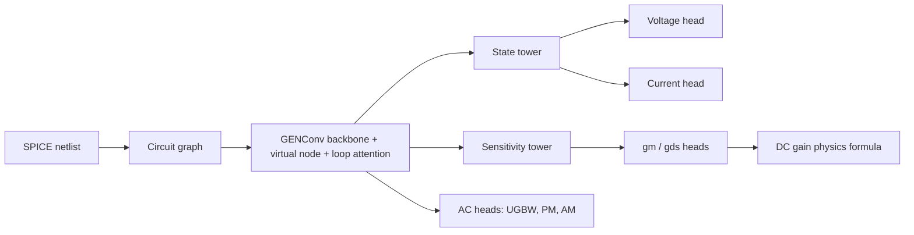

# Physics-Inspired Models for Predicting Analog Circuit Specifications

A physics-informed graph neural network that acts as a surrogate for SPICE simulation of analog circuits. Given a circuit topology and device sizes, the model predicts DC operating points, small-signal parameters and frequency-domain specifications in milliseconds instead of the seconds a full simulation takes. The physics is the point: Kirchhoff current law losses, current mirror and differential pair constraints and MOSFET device equations regularize training so the model reaches high accuracy from a few thousand simulated samples.

Developed as part of the Master's thesis *Physics-Inspired Surrogate Models for Predicting Analog Circuit Specifications*.

## What the model predicts

| Quantity | Level | Description |
|----------|-------|-------------|
| DC node voltages | per net | full operating point |
| Terminal currents | per device terminal | branch currents |
| gm and gds | per MOSFET | small-signal transconductance and output conductance |
| DC gain | per circuit | via an analytic three-stage gain formula fed by predicted gm/gds |
| UGBW, PM, AM | per circuit | unity-gain bandwidth, phase margin and gain margin |

Predicting intermediate quantities is deliberate: gm/gds predictions tell a designer why a specification is off, not just that it is off.

## How it works

Circuits are encoded as bipartite graphs: device terminals and circuit nets are nodes, physical connections are edges. Topology is given to the network rather than learned. A shared message-passing backbone feeds two specialized towers and a set of prediction heads:



Training combines data losses with physics losses:

- **KCL loss**: predicted currents must sum to zero at every internal net
- **Current constraints**: differential pairs split their tail current, mirrors scale with W/L ratios
- **Device physics**: gm and gds must be consistent with MOSFET equations per operating region
- **DC gain physics**: the analytic three-stage gain formula ties the gain prediction to predicted small-signal parameters

Each loss can be enabled, weighted and warmup-scheduled from the YAML config, which is how the thesis ablations isolate the contribution of every physics term.

## Repository layout

```
circuitgnn/            the Python package (pip install -e .)
  circuits/            SPICE netlist parser and ngspice/PySpice simulation
  data/                graph building, batching, loaders, on-disk schema notes
  physics/             SKY130 MOSFET lookup tables
  gnn/                 architectures (TowerGENConv, DeepGENConv) and components
  training/            config parsing, losses, training loops, checkpointing
scripts/               entry points (training, dataset generation, evaluation)
  analysis/            dataset and error analysis, embedding probes
  figures/             thesis figure generators
  migrations/          one-shot dataset migrations, already applied
  physics_validation/  device equation studies
  slurm/               cluster launchers
configs/               YAML experiment definitions for every thesis ablation
netlists/              SPICE templates for the 2-stage and five 3-stage opamps
docs/                  architecture notes and design specs
tests/                 smoke tests and the golden equivalence harness
```

## Installation

```bash
git clone <this repo>
cd <repo>
pip install -e .
```

Python 3.10 or newer with PyTorch 2.5 and PyTorch Geometric 2.7 (see requirements.txt for the exact versions the experiments ran with).

Training and evaluation need nothing further. Dataset generation additionally needs a system ngspice install, PySpice (`pip install -e ".[spice]"`) and the SKY130 PDK, whose location you point at with an environment variable:

```bash
export SKY130_PDK_ROOT=/path/to/sky130
```

The netlist templates reference the device models through that variable. If PySpice cannot find `libngspice`, set `PYSPICE_LIBRARY_PATH` to the directory containing it.

## Quickstart

Generate a dataset (samples device sizes, runs SPICE, builds graphs, prebatches):

```bash
python scripts/generate_dataset.py --config configs/opamp_dataset/opamp_3stage_fan_smc.yaml
```

Train:

```bash
python scripts/train_v3.py --config configs/gnn/tower/w512_dc_h128_gelu_cascode_loopwarm_v9_5k.yaml --name my_run
```

Evaluate a checkpoint:

```bash
python scripts/evaluate.py --checkpoint datasets/<dataset>/experiments/my_run/best_model.pt
```

Training writes `best_model.pt`, `config.yaml` and `training.log` into `datasets/<dataset>/experiments/<name>/`.

## Configuration

Everything about an experiment lives in one YAML file: dataset path, architecture (convolution type, backbone depth, tower depths, virtual node mode, loop attention), prediction heads, loss weights and schedules, optimizer and seeds. The `configs/gnn/tower/` tree contains the ablation families from the thesis: convolution type, attention, depth, DC gain modes, physics loss variants and data efficiency sweeps.

## Circuit topologies

SPICE templates are included for a 2-stage Miller opamp and five 3-stage opamp compensation schemes from the literature (simple Miller, two nested Miller variants, transconductance feedback and cascode feedback compensation), all sized on the SKY130 process. The multi-topology corpus supports pretraining on several topologies and zero-shot evaluation on held-out ones.

## Cluster usage

`scripts/slurm/` contains the SLURM launchers used on an H100 cluster. Walltime and memory are passed as `sbatch` flags rather than baked into separate files:

```bash
sbatch --time=4:00:00 --mem=48G scripts/slurm/run_abl.slurm <config> <run name>
```

The `#SBATCH` output directives still carry an absolute log path, because those directives cannot take shell variables. Adapt the partition, paths and environment bootstrap to your site.

## Development

```bash
pip install -e ".[dev]"
pytest tests/
```

The fast tests check that the package imports, that every shipped config parses and that both architectures register. Config keys in this codebase fall back to defaults instead of raising, so a config that fails to parse is one of the few failures that surfaces loudly, which is why all of them are exercised.

`tests/golden_forward.py` is a stricter tool for anyone modifying the model: it captures `state_dict` keys and forward outputs for a set of configs, then compares them bitwise after a change. `docs/architecture.md` explains the contracts it protects and why they are easy to break by accident.

## Citation

If you use this code, please cite the thesis:

```
Zhongkai Hu. Physics-Inspired Surrogate Models for Predicting Analog
Circuit Specifications. Master's thesis, 2026.
```
