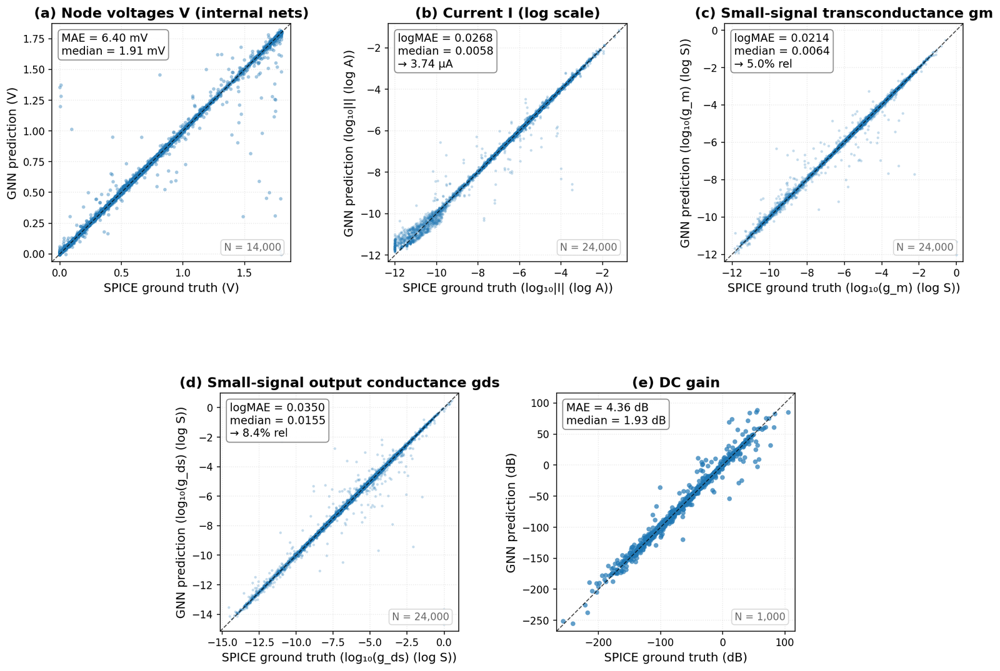
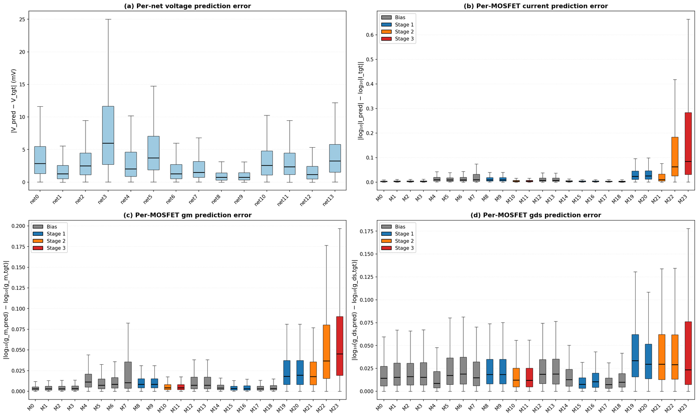
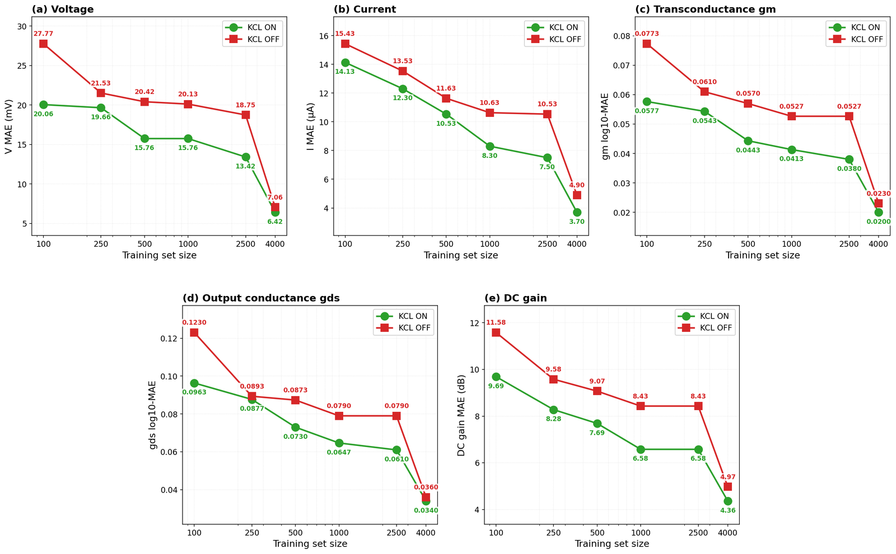
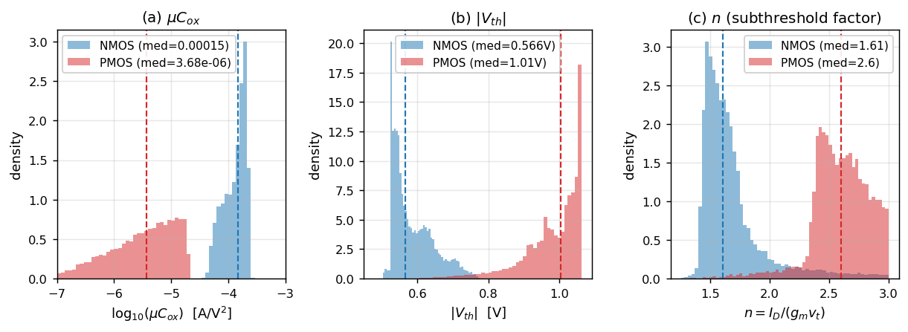
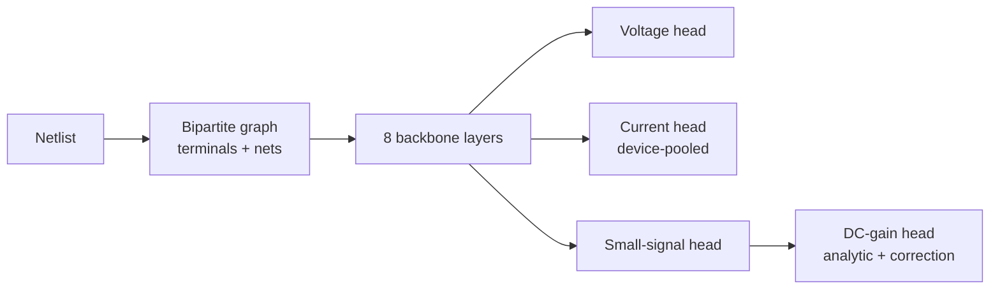

# Physics-Informed GNN for Analog Circuit Simulation

A graph neural network that predicts the result of a SPICE simulation directly from a sized transistor-level netlist. Sizing an analog operational amplifier means running a simulation for every candidate design and that simulation is the bottleneck in the design loop. This model reads the netlist as a graph and predicts the DC operating point, the per-transistor small-signal parameters and the DC gain, without invoking the simulator.

Code for the Master's thesis *Physics-Informed GNN for Analog Circuit Simulation*, Chair of Design Automation, TUM. The full thesis is in [docs/Master_Thesis.pdf](docs/Master_Thesis.pdf).

## Results

| Quantity | Level | Accuracy on the reference circuit |
|----------|-------|-----------------------------------|
| Node voltages | per internal net | 6.42 mV, about 0.36% of the supply range |
| Branch currents | per device terminal | roughly 6% per device |
| Transconductance gm | per transistor | roughly 5% per device |
| Output conductance gds | per transistor | roughly 8% per device |
| DC gain | per circuit | 4.36 dB |

Measured against NGSPICE with BSIM4 models on a held-out validation split of the three-stage Fan single-Miller-compensated amplifier (`fan_smc`).



*Predictions against SPICE ground truth on the validation set. Voltages in volts, currents and small-signal parameters in log10, DC gain in decibels. The points follow the diagonal across the full range of every quantity, including circuits that do not amplify at all.*

The error is not spread evenly across the circuit. Bias and early-stage devices, whose operating point barely moves between sizings, are predicted almost exactly. The error concentrates on the output device of each later stage, which is exactly where the simulated values swing over many decades.



*Per-device error on `fan_smc` with transistors colored by amplifier stage: (a) net voltage in mV, (b) current, (c) gm and (d) gds in log10.*

Frequency-domain metrics (unity-gain bandwidth, phase margin, gain margin) are deliberately **not** predicted. They depend on the full pole-zero structure and no simple analytical relation holds for them. Adding a bandwidth head also made every other quantity roughly twice as bad. The exploration is documented in the thesis appendix.

The training data is **unfiltered**. Poorly biased, edge-case and non-amplifying circuits are kept rather than removed, so the model covers the whole design space instead of only the well-behaved part. This makes the reported errors larger than they would be on a filtered benchmark. It also makes the model usable across the space a designer actually searches.

## The central finding

Physics helps only when the physics is exact.

Of every relation tried as a training constraint, **only Kirchhoff's current law improves the model**. Every approximate device relation makes it worse: the square-law and sub-threshold transconductance formulas, the current-mirror and differential-pair equalities and the single-pole bandwidth relation. This holds even for the most accurate unified formula tested and even for an exact auxiliary consistency term that is not a conservation law.

Adding the KCL loss lowers the error at every training-set size on every quantity. The benefit is largest when data is scarce: with 100 training samples the constrained model already matches the voltage error the unconstrained model only reaches with 1,000.



*Validation error against training-set size on `fan_smc`, with the KCL loss (green) and without it (red). Lower is better.*

The reason approximate physics fails is that the ground truth is BSIM4. The gap between a textbook equation and the simulator is not noise that averages out, it is a fixed error the constraint carries with it. The parameters those formulas treat as constant are not constant in BSIM4, so even a formula with the right shape uses the wrong numbers:

<p align="center"></p>

*Three quantities the textbook equations treat as fixed, measured across the dataset: (a) the transconductance parameter, (b) the threshold voltage and (c) the sub-threshold slope factor. None of them is constant.*

Kirchhoff's current law escapes this because it is not a device equation at all. It is current conservation, exact in any region and any process.

A second finding concerns where exact physics belongs. When a law is exact it is better built into the architecture than added to the loss, because then the model cannot violate it and spends no capacity learning to satisfy it:

- The current head predicts **one current per device** and shares it across that device's terminals, so per-device current consistency holds by construction.
- Predicting **one voltage per net** and letting every terminal inherit it satisfies Kirchhoff's voltage law by construction.
- The DC-gain head starts from an analytical gain expression evaluated on the predicted gm and gds, then learns a correction.

The soft KCL loss is the weaker form of the same idea, used where the hard form is not available.

## How the model works

Circuits become **bipartite graphs**. Every device terminal and every net is a node. Edges connect each terminal to its net, with additional edges tying the terminals of one device together. Topology is given to the network rather than inferred.



Each of the eight backbone layers applies three forms of communication in sequence, each as a gated additive update:

1. **Global self-attention** so every node gets circuit-wide context, which the DC gain needs because it depends on the whole signal path.
2. **GINE message passing** over the device-net edges for local structure. Edge features record which terminal a connection belongs to, so a gate connection is distinguishable from a drain connection.
3. **Loop attention** over the circuit's fundamental cycles, letting devices that share a loop attend to one another. Each cycle corresponds to a Kirchhoff voltage law relation. This is the single most important component: removing it more than doubles the voltage error.

The outputs of all eight layers are merged by attention-weighted jumping knowledge, concatenated with a skip connection carrying the raw device and type features. Four heads read the result.

Ablations behind these choices (message-passing operator, attention components, depth, head design) are reproducible from the configs under `configs/gnn/tower/`.

## Repository layout

```
circuitgnn/            the Python package (pip install -e .)
  circuits/            SPICE netlist parser and ngspice simulation
  data/                graph building, batching, loaders, on-disk schema
  physics/             SKY130 MOSFET lookup tables
  gnn/                 architectures and components
  training/            config, losses, training loop, checkpointing
  evaluation/          shared evaluation helpers
scripts/               entry points
  analysis/            dataset and error analysis, embedding probes
  figures/             thesis figure generators
  migrations/          one-shot dataset migrations, already applied
  physics_validation/  device equation studies
  slurm/               cluster launchers
configs/               YAML definitions for every experiment in the thesis
netlists/              SPICE templates for the two-stage and five three-stage opamps
docs/                  the thesis PDF and architecture notes
tests/                 smoke tests and the golden equivalence harness
```

## Installation

```bash
git clone <this repo>
cd <repo>
pip install -e .
```

Python 3.10 or newer with PyTorch 2.5 and PyTorch Geometric 2.7. See requirements.txt for the exact versions the experiments ran with.

Training and evaluation need nothing further. Dataset generation additionally needs a system ngspice install, PySpice (`pip install -e ".[spice]"`) and the SKY130 PDK, whose location you point at with an environment variable:

```bash
export SKY130_PDK_ROOT=/path/to/sky130
```

The netlist templates reference the device models through that variable. If PySpice cannot find `libngspice`, set `PYSPICE_LIBRARY_PATH` to the directory containing it.

## Quickstart

Generate a dataset (samples sizings by Latin hypercube, runs SPICE, builds graphs, prebatches):

```bash
python scripts/generate_dataset.py --config configs/opamp_dataset/opamp_3stage_fan_smc.yaml
```

Train the reference model:

```bash
python scripts/train_v3.py --config configs/gnn/tower/data_eff/usingnow_kclOn.yaml --name my_run
```

Evaluate a checkpoint:

```bash
python scripts/evaluate.py --checkpoint datasets/<dataset>/experiments/my_run/best_model.pt
```

Training writes `best_model.pt`, `config.yaml` and `training.log` into `datasets/<dataset>/experiments/<name>/`.

## Circuits

Five three-stage operational amplifiers from the AnalogGym benchmark suite, all in the SkyWater SKY130 process with BSIM4 models at the typical corner:

| Identifier | Compensation scheme |
|------------|--------------------|
| `fan_smc` | single Miller, the classic three-stage and the reference circuit |
| `sau_cfcc` | cross-feedforward cascode |
| `peng_tcfc` | transconductance feedforward |
| `leung_nmcf` | nested Miller with feedforward |
| `leung_nmcnr` | nested Miller without nulling resistor |

A two-stage Miller-compensated amplifier is also included, used during early development.

The five are alike at the device level yet differ sharply at the circuit level: mean DC gain ranges from -77 dB to +33 dB and the fraction of sampled circuits that amplify at all ranges from 8% to 77%.

One model trained on all five covers every topology at close to the accuracy of a dedicated per-topology model, from a fifth of the per-topology data. A topology held out entirely does not work zero-shot, but fine-tuning a pretrained model beats training from scratch at every data size.

## Configuration

One YAML per experiment covering dataset, architecture, heads, loss weights and schedules, optimizer and seed.

One sharp edge is worth knowing: unknown keys do not raise. A mistyped loss weight silently reads as its default, which quietly disables the term rather than failing loudly. If an ablation shows no effect, check the key spelling before concluding the term does nothing. `tests/test_config.py` exists because a parse failure is one of the few errors this system reports loudly.

## Cluster usage

`scripts/slurm/` contains the launchers used on an H100 cluster. Walltime and memory are passed as `sbatch` flags rather than baked into separate files:

```bash
sbatch --time=4:00:00 --mem=48G scripts/slurm/run_abl.slurm <config> <run name>
```

The `#SBATCH` output directives still carry an absolute log path, because those directives cannot take shell variables. Adapt the partition, paths and environment bootstrap to your site.

## Development

```bash
pip install -e ".[dev]"
pytest tests/
```

The fast tests check that the package imports, that every shipped config parses and that both architectures register. `tests/golden_forward.py` is a stricter tool for anyone modifying the model: it captures `state_dict` keys and forward outputs for a set of configs, then compares them bitwise after a change. `docs/architecture.md` explains the contracts it protects.

## Citation

```
Zhongkai Hu. Physics-Informed GNN for Analog Circuit Simulation.
Master's thesis, Chair of Design Automation, TUM School of Computation,
Information and Technology, Technical University of Munich, 2026.
```

The benchmark circuits come from AnalogGym (Li et al., ICCAD 2024) and the process models from the open-source SkyWater SKY130 PDK.
