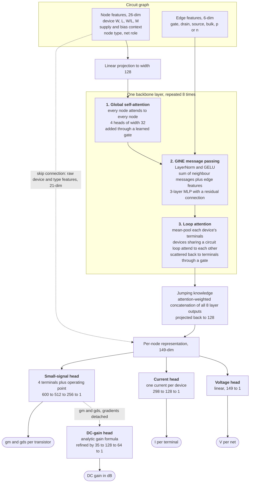
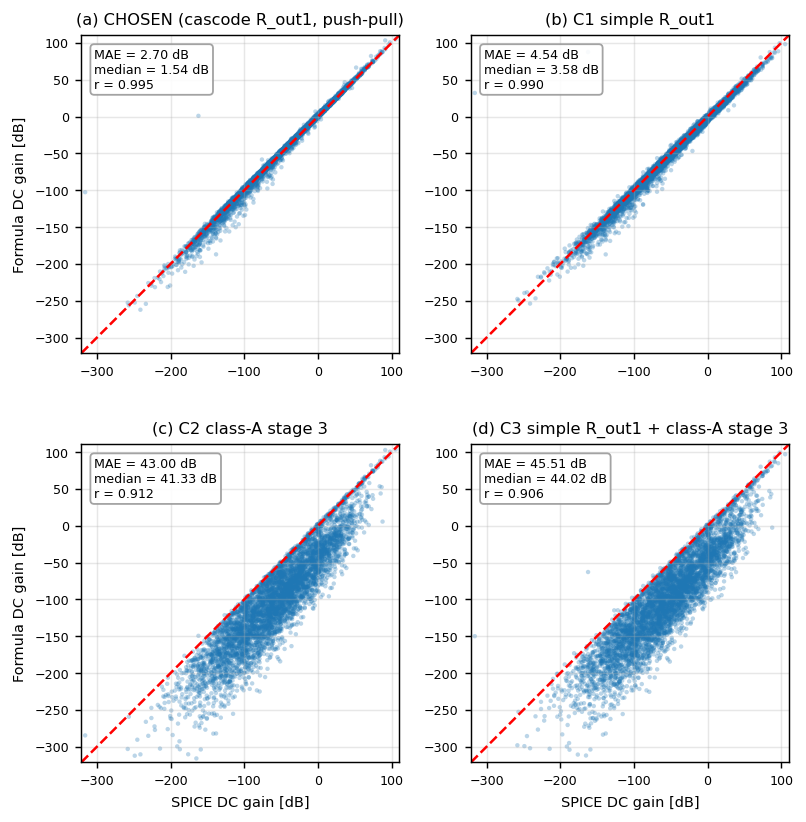
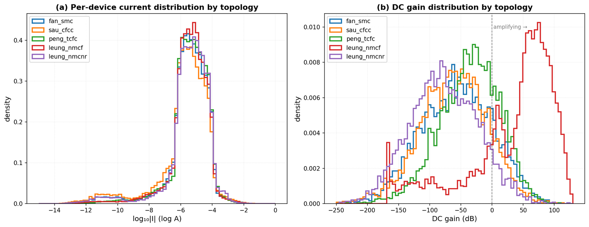
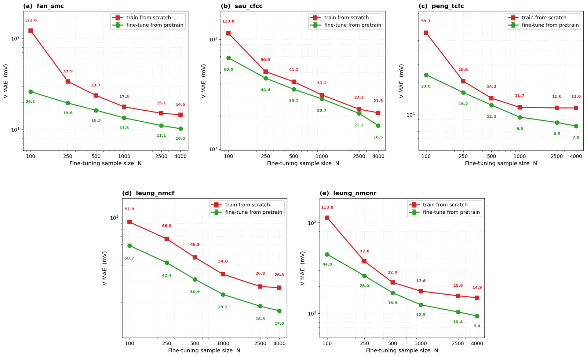

# Physics-Informed GNN for Analog Circuit Simulation

A graph neural network that predicts the result of a SPICE simulation directly from a sized transistor-level netlist. Sizing an analog operational amplifier means running a simulation for every candidate design and that simulation is the bottleneck in the design loop. This model reads the netlist as a graph and predicts the DC operating point, the per-transistor small-signal parameters and the DC gain, without invoking the simulator.

Code for the Master's thesis *Physics-Informed GNN for Analog Circuit Simulation*, Chair of Design Automation, TUM. The full thesis is in [docs/Master_Thesis.pdf](docs/Master_Thesis.pdf).

## Results

| Quantity | Level | Accuracy on the reference circuit |
|----------|-------|-----------------------------------|
| Node voltages | per internal net | 6.42 mV, about 0.36% of the supply range |
| Branch currents | per device terminal | roughly 6% per device |
| Transconductance gm | per transistor | roughly 5% per device |
| Output conductance gds | per transistor | roughly 8% per device |
| DC gain | per circuit | 4.36 dB |

Measured against NGSPICE with BSIM4 models on a held-out validation split of the three-stage Fan single-Miller-compensated amplifier (`fan_smc`).


*Predictions against SPICE ground truth on the validation set. Voltages in volts, currents and small-signal parameters in log10, DC gain in decibels. The points follow the diagonal across the full range of every quantity, including circuits that do not amplify at all.*

The error is not spread evenly across the circuit. Bias and early-stage devices, whose operating point barely moves between sizings, are predicted almost exactly. The error concentrates on the output device of each later stage, which is exactly where the simulated values swing over many decades.


*Per-device error on `fan_smc` with transistors colored by amplifier stage: (a) net voltage in mV, (b) current, (c) gm and (d) gds in log10.*

Frequency-domain metrics (unity-gain bandwidth, phase margin, gain margin) are deliberately **not** predicted. They depend on the full pole-zero structure and no simple analytical relation holds for them. Adding a bandwidth head also made every other quantity roughly twice as bad. The exploration is documented in the thesis appendix.

The training data is **unfiltered**. Poorly biased, edge-case and non-amplifying circuits are kept rather than removed, so the model covers the whole design space instead of only the well-behaved part. This makes the reported errors larger than they would be on a filtered benchmark. It also makes the model usable across the space a designer actually searches.

## The central finding

Physics helps only when the physics is exact.

Of every relation tried as a training constraint, **only Kirchhoff's current law improves the model**. Every approximate device relation makes it worse: the square-law and sub-threshold transconductance formulas, the current-mirror and differential-pair equalities and the single-pole bandwidth relation. This holds even for the most accurate unified formula tested and even for an exact auxiliary consistency term that is not a conservation law.

Adding the KCL loss lowers the error at every training-set size on every quantity. The benefit is largest when data is scarce: with 100 training samples the constrained model already matches the voltage error the unconstrained model only reaches with 1,000.


*Validation error against training-set size on `fan_smc`, with the KCL loss (green) and without it (red). Lower is better.*

The reason approximate physics fails is that the ground truth is BSIM4. The gap between a textbook equation and the simulator is not noise that averages out, it is a fixed error the constraint carries with it. The parameters those formulas treat as constant are not constant in BSIM4, so even a formula with the right shape uses the wrong numbers:

<p align="center"></p>

*Three quantities the textbook equations treat as fixed, measured across the dataset: (a) the transconductance parameter, (b) the threshold voltage and (c) the sub-threshold slope factor. None of them is constant.*

Kirchhoff's current law escapes this because it is not a device equation at all. It is current conservation, exact in any region and any process.

A second finding concerns where exact physics belongs. When a law is exact it is better built into the architecture than added to the loss, because then the model cannot violate it and spends no capacity learning to satisfy it:

- The current head predicts **one current per device** and shares it across that device's terminals, so per-device current consistency holds by construction.
- Predicting **one voltage per net** and letting every terminal inherit it satisfies Kirchhoff's voltage law by construction.
- The DC-gain head starts from an analytical gain expression evaluated on the predicted gm and gds, then learns a correction.

The soft KCL loss is the weaker form of the same idea, used where the hard form is not available.

## How the model works

Circuits become **bipartite graphs**. Every device terminal and every net is a node. Edges connect each terminal to its net, with additional edges tying the terminals of one device together, and each edge records which terminal it belongs to. Topology is given to the network rather than inferred.



What each part of a backbone layer contributes:

1. **Global self-attention** gives every node circuit-wide context in a single step. The DC gain needs this because it depends on the whole signal path and a device in the first stage shares no local neighbourhood with the output stage. It was preferred over a plain virtual node, which squeezes all global information through one vector.
2. **GINE message passing** handles local structure over the device-net edges. The edge feature is added to each neighbour's message before the nonlinearity, so the same neighbour contributes differently through a gate connection than through a drain connection. Removing the edge features raises the current error by a third.
3. **Loop attention** finds the circuit's fundamental cycles, connects every pair of devices within a cycle and lets them attend to each other. Each cycle corresponds to a Kirchhoff voltage law relation that plain message passing, reaching two hops per layer, cannot see directly. It is the single most important component: removing it more than doubles the voltage error.

The outputs of all eight layers are merged by attention-weighted jumping knowledge rather than using only the last one and a skip connection carries the raw device and type features to the heads. Eight layers was the best depth: four and six are too shallow while twelve and sixteen start to over-smooth.

The DC-gain head builds on the three-stage gain formula

$$
A_{DC} = A_1 \cdot R_{out3} \cdot \left(g_{m,M11} + A_2\, g_{m,M23}\right)
$$

where $A_1$ and $A_2$ are the first and second stage gains and $R_{out3}$ is the output-stage resistance. The first stage uses a cascode output resistance and the third stage is treated as push-pull, so the feedforward device M11 contributes to the gain. The exact form matters a lot. Evaluated on the simulated gm and gds, this formula lands within 2.70 dB of the simulator on average while the textbook class-A formulation is off by more than 40 dB:

<p align="center"></p>

*Four candidate gain formulas evaluated on the simulated gm and gds of `fan_smc`. (a) The chosen formula and (b) a simpler first-stage variant follow the diagonal. (c) and (d) model the output as class-A and miss the push-pull path.*

Ablations behind every choice above (message-passing operator, attention components, depth, head design) are reproducible from the configs under `configs/gnn/tower/`.

## Training objective

The model predicts all quantities at once. The total loss is one supervised term per quantity plus the KCL constraint, whose weight changes over training:

$$
\mathcal{L}_{\text{total}}(\theta; t) = \mathcal{L}_V + \mathcal{L}_I + \mathcal{L}_{g_m} + \mathcal{L}_{g_{ds}} + \mathcal{L}_{DC} + w_{\text{KCL}}(t)\,\mathcal{L}_{\text{KCL}}
$$

All five supervised terms have equal weight and are active from the first epoch.

**Normalization.** The targets span very different ranges, so each is standardized with training-set statistics and the model predicts in that normalized space. Currents and small-signal parameters cover many decades, so they are standardized on a log scale, with a one-picoampere floor inside the logarithm so near-zero currents stay finite:

$$
z^V_n = \frac{V_n - \mu_V}{\sigma_V}, \qquad
z^I_t = \frac{\log_{10}\left(|I_t| + 10^{-12}\right) - \mu_I}{\sigma_I}, \qquad
z^{g_m}_m = \frac{\log_{10} g_{m,m} - \mu_{g_m}}{\sigma_{g_m}}
$$

The output conductance is standardized the same way as gm and the DC gain is standardized in decibels.

**Supervised terms.** Each is a mean squared error in normalized space. They differ only in which positions they average over:

| Term | Averaged over |
|------|---------------|
| $\mathcal{L}_V$ | internal nets (supply rails and inputs have known voltages) |
| $\mathcal{L}_I$ | terminals that carry DC current: transistor drains and sources plus resistor terminals |
| $\mathcal{L}_{g_m}$ and $\mathcal{L}_{g_{ds}}$ | transistors, one value each |
| $\mathcal{L}_{DC}$ | circuits whose simulation converged to a positive gain |

**KCL constraint.** At every internal net $n$ the currents must balance. Each terminal enters with a sign, $+1$ for current flowing into the net and $-1$ for current flowing out:

$$
\sum_{t \in \text{terms}(n)} \text{sign}(t)\,|I_t| = 0
$$

Transistor drain and source signs are fixed by the device type. Every other device follows the simulated current direction, which lets the constraint handle a feedback resistor whose current reverses. Because the model predicts log-magnitudes, the residual is formed in log space. The inflowing and outflowing magnitudes are each combined with a log-sum-exp into $S^+_n$ and $S^-_n$ and the loss penalizes the gap between them:

$$
\mathcal{L}_{\text{KCL}} = \frac{1}{|\mathcal{N}_{\text{KCL}}|} \sum_{n \in \mathcal{N}_{\text{KCL}}} \left(S^+_n - S^-_n\right)^2
$$

The covered nets $\mathcal{N}_{\text{KCL}}$ leave out supply rails and inputs, nets where every terminal flows the same way so no balance is possible and nets carrying less than a nanoampere in total, where simulator noise dominates.

**Schedule.** Penalizing conservation before the individual currents are roughly right only adds gradient noise, so the constraint is phased in linearly:

$$
w_{\text{KCL}}(t) = \min\left(1,\ \max\left(0,\ \frac{t - t_0}{T_r}\right)\right), \qquad t_0 = 200,\quad T_r = 100
$$

Loop attention is phased in the same way, inactive for the first 350 epochs and then ramped in over 400. Training uses Adam at a learning rate of $3 \times 10^{-3}$ with a 50-epoch warm-up, halves the rate after 150 epochs without improvement, clips gradients at a norm of 0.3, uses batches of 1,024 circuit graphs and stops early after 500 epochs without improvement.

## Repository layout

```
circuitgnn/            the Python package (pip install -e .)
  circuits/            SPICE netlist parser and ngspice simulation
  data/                graph building, batching, loaders, on-disk schema
  physics/             SKY130 MOSFET lookup tables
  gnn/                 architectures and components
  training/            config, losses, training loop, checkpointing
  evaluation/          shared evaluation helpers
scripts/               entry points
  analysis/            dataset and error analysis, embedding probes
  figures/             thesis figure generators
  migrations/          one-shot dataset migrations, already applied
  physics_validation/  device equation studies
  slurm/               cluster launchers
configs/               YAML definitions for every experiment in the thesis
netlists/              SPICE templates for the two-stage and five three-stage opamps
docs/                  the thesis PDF and architecture notes
tests/                 smoke tests and the golden equivalence harness
```

## Installation

```bash
git clone <this repo>
cd <repo>
pip install -e .
```

Python 3.10 or newer with PyTorch 2.5 and PyTorch Geometric 2.7. See requirements.txt for the exact versions the experiments ran with.

Training and evaluation need nothing further. Dataset generation additionally needs a system ngspice install, PySpice (`pip install -e ".[spice]"`) and the SKY130 PDK, whose location you point at with an environment variable:

```bash
export SKY130_PDK_ROOT=/path/to/sky130
```

The netlist templates reference the device models through that variable. If PySpice cannot find `libngspice`, set `PYSPICE_LIBRARY_PATH` to the directory containing it.

## Quickstart

Generate a dataset (samples sizings by Latin hypercube, runs SPICE, builds graphs, prebatches):

```bash
python scripts/generate_dataset.py --config configs/opamp_dataset/opamp_3stage_fan_smc.yaml
```

Train the reference model:

```bash
python scripts/train_v3.py --config configs/gnn/tower/data_eff/usingnow_kclOn.yaml --name my_run
```

Evaluate a checkpoint:

```bash
python scripts/evaluate.py --checkpoint datasets/<dataset>/experiments/my_run/best_model.pt
```

Training writes `best_model.pt`, `config.yaml` and `training.log` into `datasets/<dataset>/experiments/<name>/`.

## Circuits

Five three-stage operational amplifiers from the AnalogGym benchmark suite, all in the SkyWater SKY130 process with BSIM4 models at the typical corner:

| Identifier | Compensation scheme |
|------------|--------------------|
| `fan_smc` | single Miller, the classic three-stage and the reference circuit |
| `sau_cfcc` | cross-feedforward cascode |
| `peng_tcfc` | transconductance feedforward |
| `leung_nmcf` | nested Miller with feedforward |
| `leung_nmcnr` | nested Miller without nulling resistor |

A two-stage Miller-compensated amplifier is also included, used during early development.

The five are alike at the device level yet differ sharply at the circuit level: mean DC gain ranges from -77 dB to +33 dB and the fraction of sampled circuits that amplify at all ranges from 8% to 77%.



*(a) The per-device current is distributed almost identically across the five topologies. (b) The DC gain is where they split, with most topologies sitting well below the amplifying threshold.*

One model trained on all five covers every topology at close to the accuracy of a dedicated per-topology model, from a fifth of the per-topology data. A topology held out entirely does not work zero-shot, but a model pretrained on the other four and fine-tuned on the new one beats training from scratch at every data size. The gap is widest when data is scarce.



*Voltage error on each held-out topology after fine-tuning a model pretrained on the other four (green) against training from scratch (red), at each fine-tuning sample size N.*

## Configuration

One YAML per experiment covering dataset, architecture, heads, loss weights and schedules, optimizer and seed.

One sharp edge is worth knowing: unknown keys do not raise. A mistyped loss weight silently reads as its default, which quietly disables the term rather than failing loudly. If an ablation shows no effect, check the key spelling before concluding the term does nothing. `tests/test_config.py` exists because a parse failure is one of the few errors this system reports loudly.

## Cluster usage

`scripts/slurm/` contains the launchers used on an H100 cluster. Walltime and memory are passed as `sbatch` flags rather than baked into separate files:

```bash
sbatch --time=4:00:00 --mem=48G scripts/slurm/run_abl.slurm <config> <run name>
```

The `#SBATCH` output directives still carry an absolute log path, because those directives cannot take shell variables. Adapt the partition, paths and environment bootstrap to your site.

## Development

```bash
pip install -e ".[dev]"
pytest tests/
```

The fast tests check that the package imports, that every shipped config parses and that both architectures register. `tests/golden_forward.py` is a stricter tool for anyone modifying the model: it captures `state_dict` keys and forward outputs for a set of configs, then compares them bitwise after a change. `docs/architecture.md` explains the contracts it protects.

## Citation

```
Zhongkai Hu. Physics-Informed GNN for Analog Circuit Simulation.
Master's thesis, Chair of Design Automation, TUM School of Computation,
Information and Technology, Technical University of Munich, 2026.
```

The benchmark circuits come from AnalogGym (Li et al., ICCAD 2024) and the process models from the open-source SkyWater SKY130 PDK.
